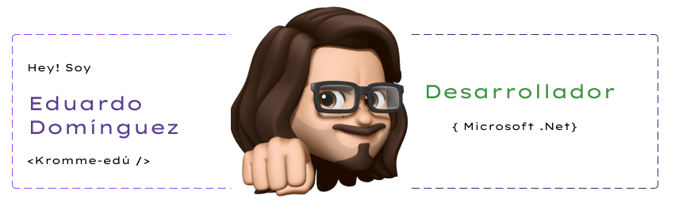

### Hola!  👋

<!--
**kromee/kromee** is a ✨ _special_ ✨ repository because its `README.md` (this file) appears on your GitHub profile.

Here are some ideas to get you started:

- 🔭 I’m currently working on ...
- 🌱 I’m currently learning ...
- 👯 I’m looking to collaborate on ...
- 🤔 I’m looking for help with ...
- 💬 Ask me about ...
- 📫 How to reach me: ...
- 😄 Pronouns: ...
- ⚡ Fun fact: ...
-->

 

 
  <samp>
     
    「 Soy desarrollador Full-Stack .Net <b>Mexicano</b> con más de 10 años de experiencia 」
     
     
  </samp>

 # Acerca de mi
- 🔭 Soy Eduardo, mi familia y amigos me dicen Lalo, actualmente trabajo como desarrollador .net, la primera vez que programé fue en la universidad en el lenguaje C. Desde entonces me he mantenido en constante preparación logrando el título de licenciatura, ingeniería y un Master en Análitica e inteligencia de negocios, todo es relacionado a la informática.
- ⚡ Soy orgullosamente poblano y de sus sabores gastronómicos, fan de lo tencnológico y de la música regional mexicana.
- 🌱 Como programador .Net con mas de 10 años de experiencia eh desarrollado diferentes aplicativos de software aplicados a procesos empresariales. 
- 👯 Actualmente estoy aprendiendo nuevos lenguajes de programación como React y Paython con el objetivo de aplicar ciencia de datos.
- 🤔 Estoy buscando colaborar en proyectos que demanden nuevos retos en análisis de datos.
- 💬 Preguntame sobre desarrollo web, movil y de escritorio, me considero fullstack .Net.
- 📫 Como contactarme:  [renixedu@gmail.com](mailto:renixedu@gmail.com)

## Para desarrollar uso

## Mis estádisticos

  

  <b><em>GitHub</em></b>  
       
  <b><em>Actividad de programación (Últimos 7 días):</em></b>  
    
  

